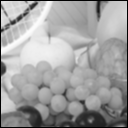

# fpga_image_processing (WIP)

Implementation of simple image processing operations in verilog. This project revolves around a central image processing module `image_processing.v` which can be included in a simulation environment using verilator or it can be included in a `top.v` for the ice40 Ultraplus fpga.

As it is targeted to low end fpga devices (both in price and power consumption) such as the ice40 ultraplus. It uses 1Mbit of ram to store the images into
two buffers, the input and the storage buffer.
Images are loaded and read in the input buffer, the calculations are done on the storage buffer. The two buffers can be swapped.

Operations requiring two images (add, sub) will use the two buffers.

The software communicates with the simulated fpga controller via a communication channel and will respond to memory access.

The goal in the future is to have the communication channel done with a SPI module and the memory access with the memory available to the ice40 fpga.

The images are stored in a .h (done with gimp).

### Operations
- per pixel ops
   - add/sub
   - invert
   - threshold
   - mult/div
- 3x3 matrix convolution
   - apply convolution on storage buffer, writes result back
   - apply convolution on input buffer, adds result with storage buffer.
- combine input and buffer
   - add
   - sub
   - mult
-- switch input and buffer

### examples

| Original  |  |
| -------  | ------- |
| Add & threshold  |   |
| Multiplication 0.5x |   |
| Gaussian  |   |
| Edge detection  |    |

### fixed points

Operations such as multiplication or convolutions require real numbers. For example the gaussian blur
is implemented using a kernel whose sum is one, so each element of the kernel should be <= 1.0.

Real numbers are represented as fixed point numbers on 8 bits.
The first bit is used as the sign bit, 3 bits for the numbers and 4 for the fractions.
This means the values can go from -7.0 to 7.0 with a precision of 0.0625 (1/2^4).

<!-- ### Commands
- format: command+data_to_receive-data_to_send
- set_params/init, command+width[15:0] height[15:0]-
- send_image, command+image[width*height:0]-
- read_image, command+-image[width*height:0]
- get_status command+-status[31:0]
- apply_add command+val[15:0]
- threshold command+val[7:0]+replacement[7:0]+upper[0] (upper == 1 will replace everything >val with replacement) -->

# Build & run

### Simulation

`./build_simulation.sh` Builds the simulation and C program

`./simu` Runs simulator

`./run_gnuplot.sh` to display the output (`output.dat`) in gnuplot

## Needed tools

Verilator 3.874

gnuplot 5.0
