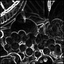
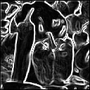

# fpga_image_processing (WIP)

Implementation of simple image processing operations in verilog. This project revolves around a central image processing module `image_processing.v` which can be included in a simulation environment using verilator or it can be included in a `top.v` for the ice40 Ultraplus fpga.

As it is targeted to low end fpga devices (both in price and power consumption) such as the ice40 ultraplus. It uses 1Mbit of ram to store the images into
two buffers, the input and the storage buffer.
Images are loaded and read in the input buffer, the calculations are done on the storage buffer. The two buffers can be swapped.

Operations requiring two images (add, sub) will use the two buffers.

The software communicates with the simulated fpga controller via a communication channel and will respond to memory access.

The goal in the future is to have the communication channel done with a SPI module and the memory access with the memory available to the ice40 fpga.

The images are stored in a .h (done with gimp).

### Operations
- per pixel ops
   - add/sub
   - invert
   - threshold
   - mult/div
- 3x3 matrix convolution
   - apply convolution on storage buffer, writes result back
   - apply convolution on input buffer, adds result with storage buffer.
- binary operation (input *op* buffer)
   - add
   - sub
   - mult
- switch input and buffer
- load image to input
- read image from input

### Examples

<table>
    <thead>
        <tr>
            <th>Original</th>
            <th></th>
            <th></th>
        </tr>
    </thead>
    <tbody>
        <tr>
            <td>Add & threshold</td>
            <td></td>
            <td></td>
        </tr>
        <tr>
            <td>Multiplication 0.5x</td>
            <td></td>
            <td></td>
        </tr>
        <tr>
            <td>Gaussian blur</td>
            <td></td>
            <td></td>
        </tr>
        <tr>
            <td>Edge detection</td>
            <td></td>
            <td></td>
        </tr>
        <tr>
            <td>Average  
            0.5\*fruits+0.5\*peppers</td>
            <td colspan=2 align="center"></td>
        </tr>
        <tr>
            <td>Difference  
            abs(fruits-peppers)</td>
            <td colspan=2 align="center"></td>
        </tr>
    </tbody>
</table>
### Fixed point calculation

Operations such as multiplication or convolutions require real numbers. For example the gaussian blur
is implemented using a kernel whose sum is one, so each element of the kernel should be <= 1.0.

Real numbers are represented as fixed point numbers on 8 bits.
The first bit is used as the sign bit, 3 bits for the numbers and 4 for the fractions.
This means the values can go from -7.0 to 7.0 with a precision of 0.0625 (1/2^4).

### Architecture

Two modes of operation are possible: simulation with verilator or running on ice40 fpga.

The specific files for these two modes are situated in the `simulation/` and `ice40/` folders.

The two implementations of the image processing interface `software/image_processing.hpp` reflect this architecture by either communicating
with the verlator class or the ice40 fpga via SPI.

```
+---------------------+        +-----------------------+
|                     |        |                       |
|                     |        |                       |
| main.cpp            +--------+ Image_processing.hpp  |
|                     |        |                       |
|                     |        |                       |
+---------------------+        +---------+-------------+
                                         ^
                                         |
                            +------------+-----------+
                            |                        |
+----------------+      +---------+-------------+  +-------+-----------+              +-----------+
|                |      |                       |  |                   |              |           |
| Verilator      |      | IP_simulation.hpp     |  | IP_ice40.hpp      |      SPI     | FPGA      |
| Simulation     +------+ IP_simulation.cpp     |  | IP_ice40.cpp      +--------------+ Ice40     |
| obj_dir/       |      |                       |  |                   |              |           |
|                |      |                       |  |                   |              |           |
+----------------+      +-----------------------+  +-------------------+              +-----------+

```

# Build & run

### Simulation

`./build_simulation.sh` Builds the simulation and C program

`./simu` Runs simulator

`./run_gnuplot.sh` to display the output (`output.dat`) in gnuplot

### ice40

Tested with an ice40 ultraplus on a breakout board

In `ice40/hdl/` create the bitstream by calling `make`

Call `make prog` to program the `top.v` bitstream on the fpga

To compile the host software, call `build_ice40.sh` in the root

Call `soft_ice40` which will communicate with the fpga (send images, receive them)

As with the simulation, `./run_gnuplot.sh` to display the output (`output.dat`) in gnuplot

## Needed tools

Verilator 3.874

gnuplot 5.0

yosys 0.9
